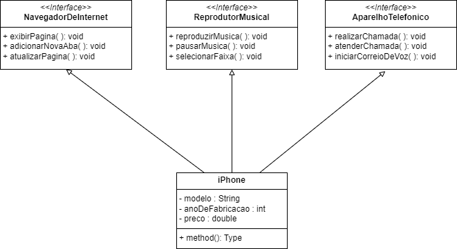

# POO Java Basics

## Challange
- Modelagem e diagramação da representação em UML e Código no que se refere ao componente iPhone.

### iPhone Component

- Com base no vídeo de lançamento do iPhone em 2007, foi elaborado  a 
diagramação de classes e interfaces com a proposta de repreentar os papéis
do iPhone: Reprodutor Musical, Aparelho Telefônico, Navegação na Internet.
- Também foram criadas classes e interfaces no formato de arquivo.java.
[Lançamento iPhone 2007](https://www.youtube.com/watch?v=9ou608QQRq8)

### Comportamentos esperados:
* Repodutor Musicial: tocar, pausar, selecionarMusica
* Aparelho Telefônico: ligar, atender, iniciarCorrerioVoz
* Navegador na Internet: exibirPagina, adicionarNovaAba, atualizarPagina

### Diagrama de Classes
